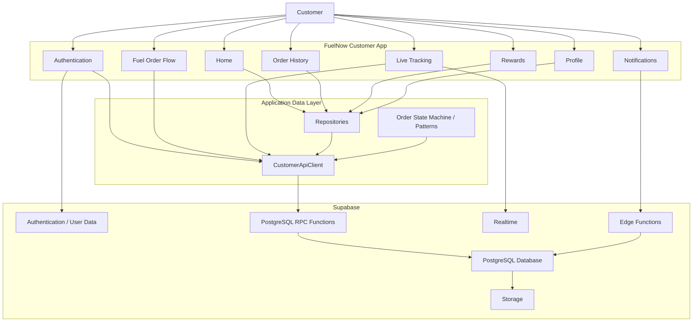
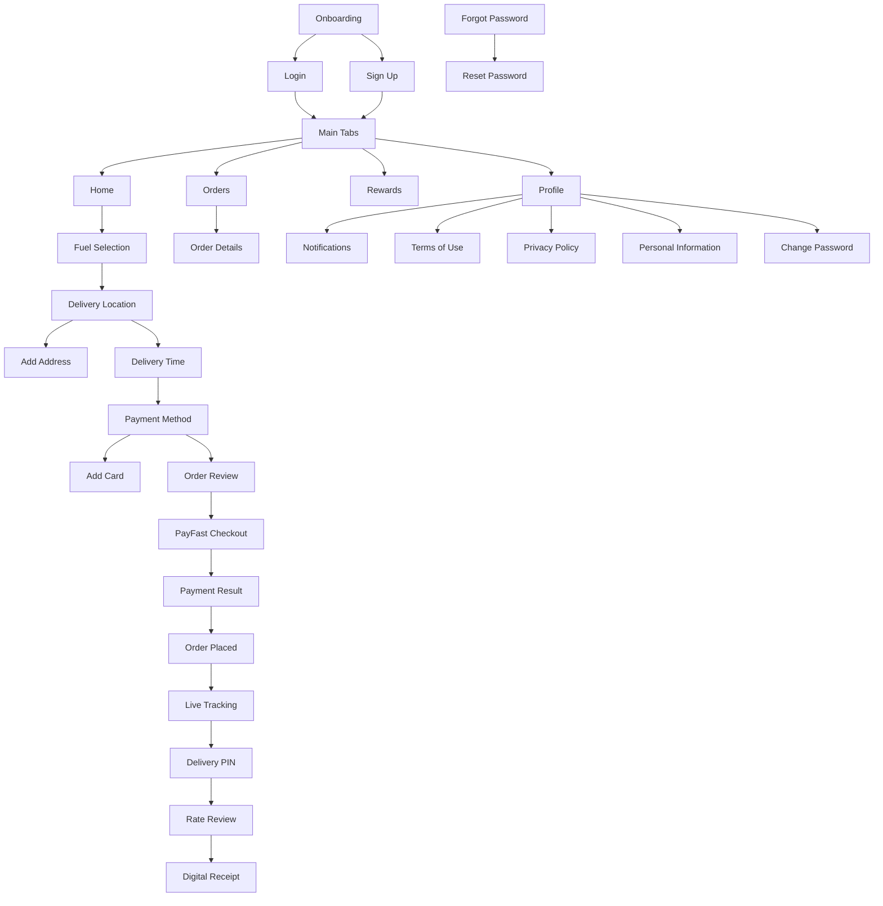
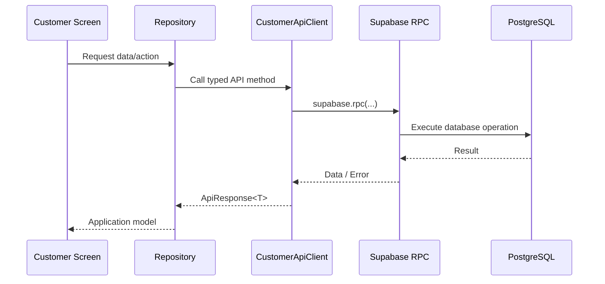
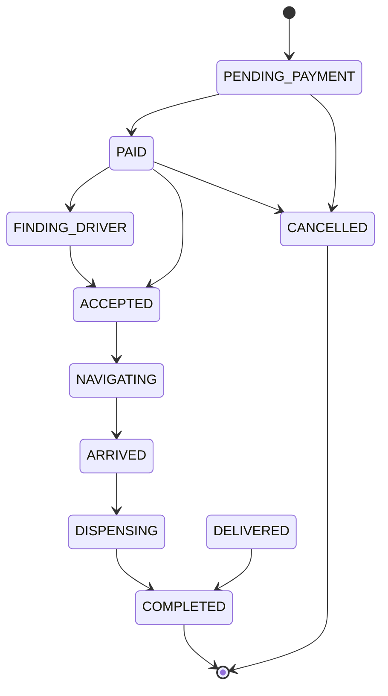
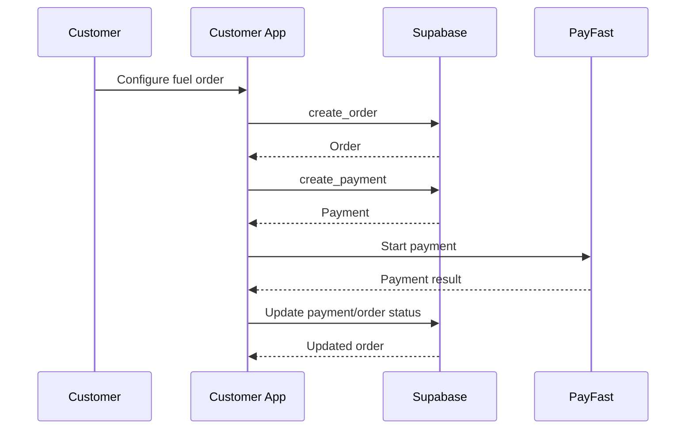
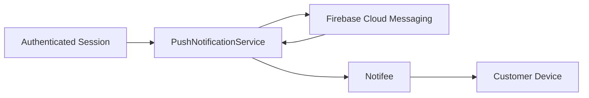
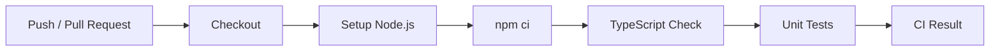

# FuelNow Customer App

The FuelNow Customer App is the customer-facing mobile application for the FuelNow fuel delivery platform.

Customers use the application to register and authenticate, select fuel, provide a delivery location, create and pay for fuel orders, track deliveries, receive notifications, review completed deliveries, manage their profile, and access rewards.

The application is built with React Native and Expo and uses Supabase as its backend platform.

---

## 1. Application Overview



---

## 2. Technology Stack

| Technology               | Purpose                                     |
| ------------------------ | ------------------------------------------- |
| React Native             | Mobile application framework                |
| Expo SDK 57              | React Native development and native tooling |
| TypeScript               | Static typing                               |
| React Navigation         | Application navigation                      |
| Supabase                 | Backend platform                            |
| PostgreSQL               | Persistent application data                 |
| Supabase RPC             | Database operations                         |
| Supabase Realtime        | Live application updates                    |
| Supabase Edge Functions  | Server-side functions                       |
| Firebase Cloud Messaging | Push notifications                          |
| Notifee                  | Native notification handling                |
| Leaflet                  | Web map rendering                           |
| React Native WebView     | Web content integration                     |
| i18next                  | Internationalisation                        |
| Vitest                   | Unit testing                                |

---

## 3. Project Structure

```text
FuelNow-Customer/
│
├── android/
│
├── assets/
│
├── __tests__/
│   └── orderStateMachine.test.ts
│
├── src/
│   ├── components/
│   │
│   ├── context/
│   │
│   ├── i18n/
│   │
│   ├── patterns/
│   │
│   ├── repositories/
│   │   ├── DriverRepository.ts
│   │   ├── FuelRateRepository.ts
│   │   ├── NotificationRepository.ts
│   │   ├── OrderRepository.ts
│   │   ├── SOSRepository.ts
│   │   └── UserRepository.ts
│   │
│   ├── screens/
│   │   ├── auth/
│   │   ├── history/
│   │   ├── home/
│   │   ├── notifications/
│   │   ├── onboarding/
│   │   ├── order/
│   │   ├── profile/
│   │   └── rewards/
│   │
│   ├── services/
│   │   ├── apiClient.ts
│   │   ├── geocoding.ts
│   │   ├── mockApi.ts
│   │   ├── payfast.ts
│   │   ├── PushNotificationService.ts
│   │   └── supabase.ts
│   │
│   ├── theme/
│   │
│   └── types/
│
├── App.tsx
├── app.json
├── package.json
├── package-lock.json
├── tsconfig.json
└── vitest.config.ts
```

---

## 4. Application Navigation



---

## 5. Backend Architecture

The Customer App does not expose a traditional REST API layer.

Application operations are wrapped by `CustomerApiClient` and repository classes and then executed through Supabase.



---

## 6. Supabase RPC Interface

The application calls PostgreSQL functions through `supabase.rpc()`.

### Authentication and Users

```text
sign_in_with_password
get_user
create_user
update_user
delete_user
is_customer
```

### Customer

```text
get_customer
create_customer
update_customer
delete_customer
```

### Addresses

```text
get_address
create_address
update_address
delete_address
```

### Orders

```text
get_order
create_order
update_order
delete_order
```

### Payments

```text
get_payment
create_payment
update_payment
delete_payment
```

### Reviews

```text
get_review
create_review
update_review
delete_review
```

### Rewards

```text
get_reward_account
create_reward_account
update_reward_account
delete_reward_account
```

### Fuel Data

```text
get_fuel_type
get_fuel_rate
```

The exact RPC parameters are defined in:

```text
src/services/apiClient.ts
```

---

## 7. Order Lifecycle

The customer application uses a state-machine approach to represent order progression.



Driver assignment requires a driver ID.

Completion from the dispensing stage requires proof-of-delivery information.

---

## 8. Order Creation

The Customer API sends order information through the `create_order` RPC.

Typical information includes:

```text
customerId
driverId
addressId
fuelTypeId
orderMethod
volumeLitres
randAmount
deliveryType
scheduledDateTime
status
deliveryPin
```

The default initial status is:

```text
PENDING_PAYMENT
```

---

## 9. Payment Flow



The Customer App contains:

```text
src/services/payfast.ts
src/screens/order/PayFastCheckoutScreen.tsx
src/screens/order/PaymentResultScreen.tsx
```

---

## 10. Notifications

Push notification handling is implemented through:

```text
@react-native-firebase/app
@react-native-firebase/messaging
@notifee/react-native
```

The main implementation is:

```text
src/services/PushNotificationService.ts
```

Notification initialization occurs after an authenticated Supabase session is detected.



---

## 11. Maps and Location

The application supports location-aware delivery.

Native functionality uses Expo location services.

Web functionality uses Leaflet.

```text
Native
    |
    +-- expo-location

Web
    |
    +-- Leaflet
    +-- leaflet/dist/leaflet.css
```

Map components include:

```text
DeliveryMap.native.tsx
DeliveryMap.web.tsx
TrackingMap.native.tsx
TrackingMap.web.tsx
```

---

## 12. Environment Variables

The application expects Supabase configuration through Expo environment variables.

```env
EXPO_PUBLIC_SUPABASE_URL=your_supabase_url
EXPO_PUBLIC_SUPABASE_ANON_KEY=your_supabase_anon_key
```

Do not commit private credentials, service-role keys, Firebase private keys, or other secrets.

---

## 13. Installation

```bash
npm ci
```

Start Expo:

```bash
npm start
```

Android development:

```bash
npm run android
```

Web:

```bash
npm run web
```

---

## 14. Testing

Run unit tests:

```bash
npm test
```

Watch mode:

```bash
npm run test:watch
```

Coverage:

```bash
npm run test:coverage
```

TypeScript validation:

```bash
npx tsc --noEmit
```

The project contains unit tests for the customer order state machine.

---

## 15. CI/CD

GitHub Actions is configured to run automated validation on pushes and pull requests targeting `main`.

The intended pipeline is:



---

## 16. Build and APK

The Customer App is an Expo React Native application and can be compiled into an Android application using the native Android project.

Typical local Android build:

```bash
cd android
gradlew.bat assembleDebug
```

The resulting APK is generated under:

```text
android/app/build/outputs/apk/debug/
```

Native modules such as Firebase, Notifee, WebView, and Expo native packages require a native rebuild after dependency or configuration changes.

---

## 17. Security

The Customer App uses Supabase's client-side anonymous key.

The following must never be bundled into the application:

```text
Supabase service-role key
Database passwords
Private Firebase credentials
Server-side secrets
Payment gateway private credentials
```

Database authorization should be enforced through Supabase Row Level Security and server-side database functions.

---

## 18. Current Scope

The Customer App currently covers:

* Customer authentication
* Onboarding
* Customer profile management
* Address management
* Fuel selection
* Delivery scheduling
* Order creation
* Payment processing
* Live order tracking
* Delivery PIN
* Proof-of-delivery flow
* Order history
* Reviews
* Rewards
* Notifications
* SOS functionality
* Terms and privacy screens
* Push notification handling
* Web map support
* Android native support

---

## 19. Repository Responsibilities

The Customer App is responsible for the customer experience only.

It should not contain:

* Driver administration
* Fleet administration
* Platform administration
* Administrative reporting
* Driver account management
* Vehicle management

Those responsibilities belong to the Driver and Admin applications.

---

## 20. Development Principle

The application follows a layered structure:

```text
Screens
   ↓
Components / Context
   ↓
Repositories
   ↓
CustomerApiClient
   ↓
Supabase RPC / Realtime / Edge Functions
   ↓
PostgreSQL
```

This separation keeps UI logic separate from data-access logic and allows the application's backend interactions to remain centrally managed.
